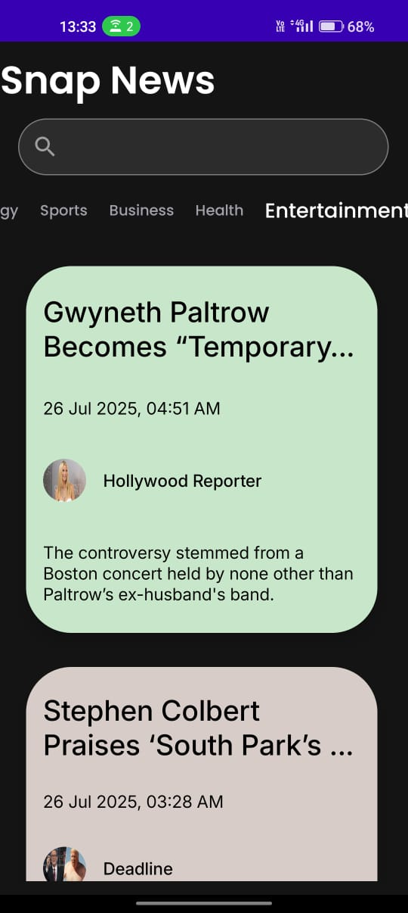

# SnapNews
# 📰 SnapNewsApp

SnapNewsApp is a lightweight, modern news application that lets users browse and read the latest headlines with a clean UI and smooth experience. Built using **Jetpack Compose** and powered by the **NewsAPI**, the app follows the **MVVM architecture** for scalability and maintainability.

---

## 🚀 Features

- 🧠 MVVM architecture with clean separation of concerns
- 🌐 Real-time news fetched from [NewsAPI.org](https://newsapi.org)
- 📱 Clean, intuitive UI with Jetpack Compose
- 📄 Details screen to read full news articles
- ⚡ Efficient state management with `StateFlow`

---

## 🧱 Architecture

The app is structured using the **Model-View-ViewModel (MVVM)** pattern:

- **Model** → Represents news data (title, description, image, etc.)
- **ViewModel** → Handles business logic and state
- **View (UI)** → Composable screens
- **Repository** → Abstracts API calls using Retrofit

---

## 🖼 Screenshots

<table>
  <tr>
    <td align="center">
      
      <br/><b>Home Screen</b>
    </td>
    <td align="center">
      
      <br/><b>Details Screen</b>
    </td>
  </tr>
</table>

---

## 🔧 Tech Stack

- ✅ Kotlin
- ✅ Jetpack Compose
- ✅ MVVM Architecture
- ✅ Retrofit + Coroutines
- ✅ NewsAPI for latest headlines
- ✅ StateFlow for reactive UI updates

---

## 🛠 Setup Instructions

1. **Clone the repo:**
   ```bash
   git clone https://github.com/aditikadhiman/SnapNewsApp.git
